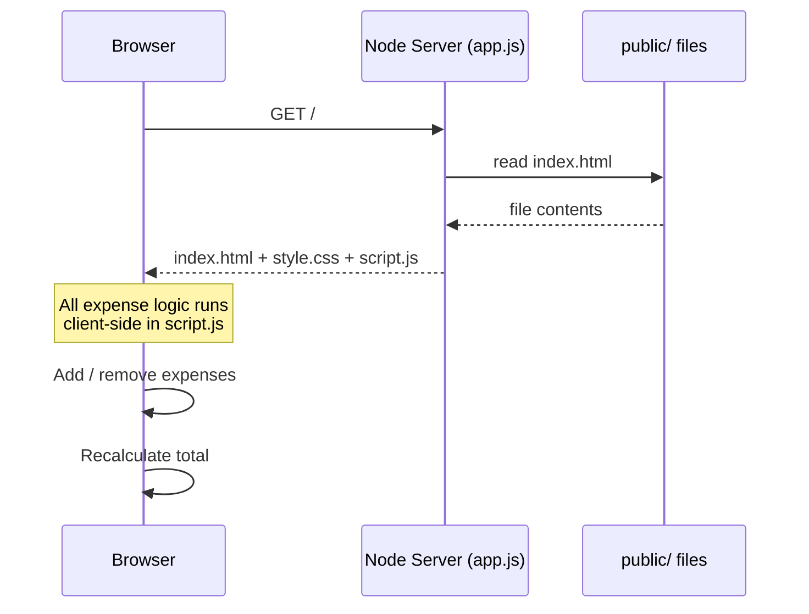

# 💰 Daily Expense Calculator

A simple Node.js web app to track and calculate your daily expenses — built with zero external dependencies (just Node's built-in `http` module) as a first project for learning deployment and DevOps workflows.


---

## ✨ Features

- ➕ Add an expense name and amount
- 📋 View all expenses in a running list
- ➗ Auto-calculated total
- ❌ Remove individual expenses
- 🧹 Clear all expenses at once
- ⚡ No database, no build step, no npm install — just run it

---

## 📸 Preview

```
┌───────────────────────────────────────┐
│        Daily Expense Calculator        │
├───────────────────────────────────────┤
│  [ Expense name        ] [ Amount ]    │
│  [            Add Expense          ]   │
├───────────────────────────────────────┤
│  Lunch                        $12.50 ✕ │
│  Coffee                        $4.00 ✕ │
│  Bus fare                      $2.75 ✕ │
├───────────────────────────────────────┤
│                     Total:   $19.25    │
│  [             Clear All            ]  │
└───────────────────────────────────────┘
```

---

## 🗂️ Project Structure

```
daily-expense-app/
├── app.js              # Tiny Node.js static file server
└── public/
    ├── index.html       # App layout
    ├── style.css         # Styling
    └── script.js         # Expense logic (add/remove/total)
```

---

## 🔁 How It Works



The server's only job is to serve static files. All the expense-tracking logic (adding, removing, totaling) runs entirely in the browser via `script.js` — nothing is saved server-side, so refreshing the page resets the list.

---

## 🚀 Getting Started

### Prerequisites
- [Node.js](https://nodejs.org/) v18 or higher

### Run locally

```bash
git clone <your-repo-url>
cd daily-expense-app
node app.js
```

Then open your browser to:

```
http://localhost:3000
```

---

## 🌍 Deployment

This app has no dependencies and no build step, which makes it a good candidate for learning basic deployment:

- **AWS EC2** — clone the repo, install Node.js, run `node app.js` (ideally behind `pm2` or as a `systemd` service)
- **AWS Elastic Beanstalk** — deploy directly as a Node.js application
- **Docker** — containerize with a minimal `node:18-alpine` base image

---

## 🛠️ Tech Stack

- **Backend:** Node.js (built-in `http` and `fs` modules — no Express)
- **Frontend:** Vanilla HTML, CSS, JavaScript

---

## 📄 License

MIT — free to use and modify for learning purposes.
